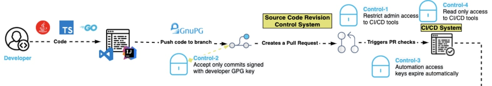
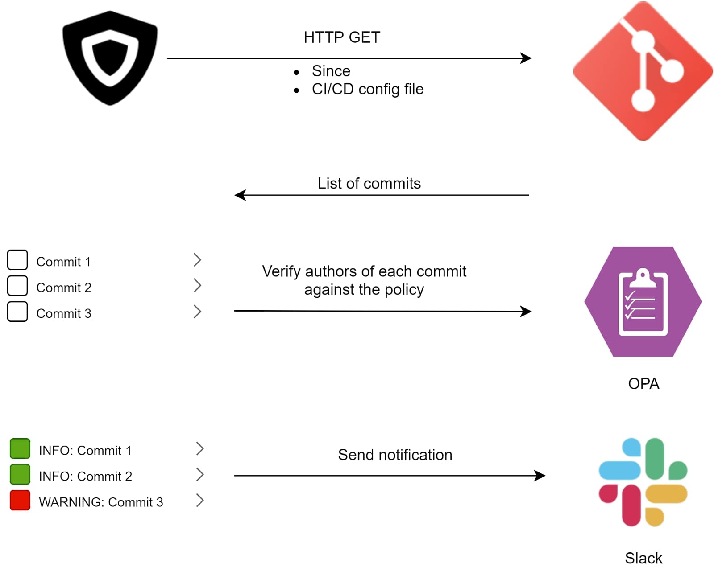
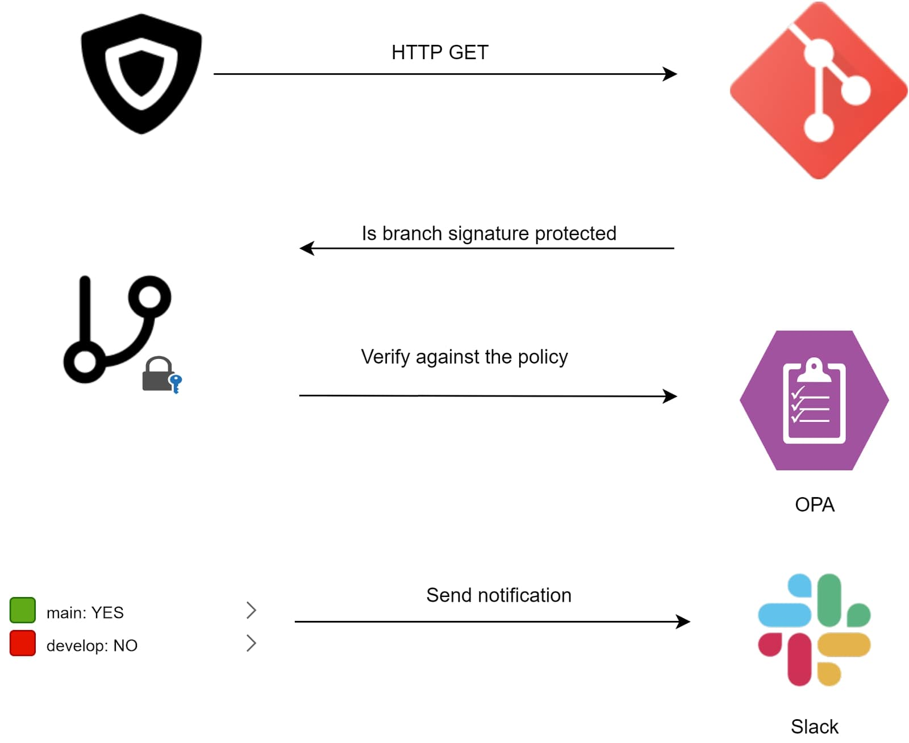
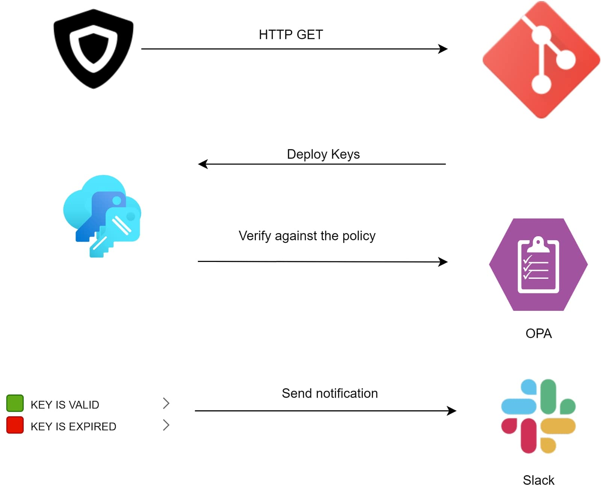
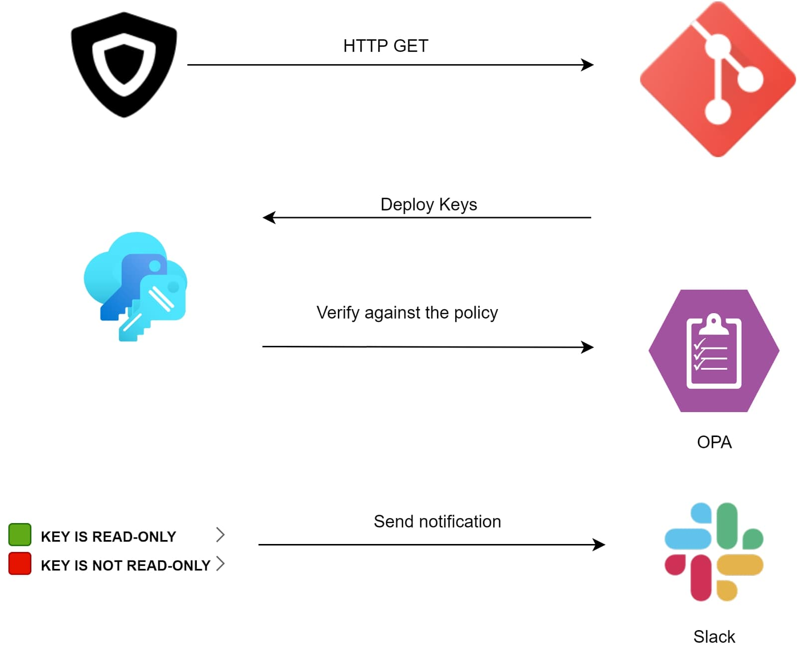

Table of Contents
=================

  * [Overview](#Overview)
  * [Policies](#Policies)
    * [Control 1](#control-1-restrict-administrative-access-to-cicd-tools)
    * [Control 2](#control-2-only-accept-commits-signed-with-a-developer-gpg-key)
    * [Control 3](#control-3-automation-access-keys-expire-automatically)
    * [Control 4](#control-4-reduce-automation-access-to-read-only)
  * [Usage](#Usage)
    * [Configuration](docs/config.md)
    * [Deployment](docs/deploy.md)
      * [CLI](docs/deploy.md#CLI)
      * [Terraform](terraform/README.md)
        * [Prerequisites](terraform/README.md#prerequisites)
          * [AWS Lambda - Secure Pipeline Verifier](terraform/README.md#aws-lambda---secure-pipeline-verifier)
          * [AWS Lambda - ChatOps](terraform/README.md#optional-aws-lambda---chatops)
        * [Run Terraform](terraform/README.md#run-terraform)
        * [Configure ChatOps](terraform/README.md#configure-chatops)
    * [Notifications](docs/notifications.md)

## Overview
### Secure Pipeline Verifier

The focus of the *Secure Pipeline Verifier* is to execute policies that represent the first four controls of the [Venafi Secure Software Pipeline Blueprint](https://github.com/Venafi/blueprint-securesoftwarepipeline).
The diagram below is a subset of the overall blueprint showing the specific activities where the first four controls are executed alongside a repository pipeline.  
A wider flow diagram of the overall blueprint can be located in the [Secure Software Pipeline Blueprint repository](https://github.com/Venafi/blueprint-securesoftwarepipeline#blueprint-in-action)

These controls can be executed against repositories that are hosted on either GitHub or GitLab.

This project is able to provision an AWS infrastructure with Terraform, so that the application can be run on a schedule.
You can also run the application via the CLI on your local machine.  

## Policies
Here's the list of policies checks that the application allows you to run on your repository: 

### Control 1: Restrict administrative access to CI/CD tools

It's important to ensure that only authorized persons can make administrative changes to the CI/CD system. 
If an unauthorized person is able to gain access, changes to pipeline definitions enable the subversion of many of the remaining controls in this document.

To represent control 1 the verifier will obtain a list of all the commits since it was last executed.  
Each commit is checked against a policy that represents a list of employees that have permission to alter CI/CD resources within the repository.
The verifier will not block, but will inform the appropriate Slack channel of any unauthorised activity. 

### Control 2: Only accept commits signed with a developer GPG key
Unsigned code commits are challenging, if not impossible, to trace and pose a risk to the integrity of the code base. 
Requiring commits to be signed with a developer GPG key helps to ensure non-repudiation of commits and increases the burden on the attacker seeking to insert malicious code.

When this control is enabled, it validates the authorship of the commits.  The verifier does this by checking if the commits in specific branches from the 
repository are signature protected with a developer GPG key.

### Control 3: Automation access keys expire automatically
Ensuring that access keys used by automation expire periodically creates a shorter window of attack when keys are compromised.

The verifier checks if the deployment keys in the repository have expired. The verifier does this by checking if the keys have been 
in use for more than a specific amount of time (by default 1 month).

### Control 4: Reduce automation access to read only
CI systems should have *read only access* to source code repositories following the principle of least privilege access.

To implement this control the verifier makes use of GitHub/GitLab APIs to collect information on the automated keys enabled in the repository. 
Each key is verified that their access to the source code is read-only.

## Usage
In order to use this application, you must have an active account on GitHub/GilLab and admin access to the repository you want to run the policies on.
You also need to generate a Personal Access Token on [GitHub](https://docs.github.com/en/authentication/keeping-your-account-and-data-secure/creating-a-personal-access-token) 
or [GitLab](https://docs.gitlab.com/ee/user/profile/personal_access_tokens.html) with repo access for the APIs to work.

In this guide we're going to take a look at how to [configure](docs/config.md) it, [deploy](docs/deploy.md) it and what we can [expect](docs/notifications.md) from it.