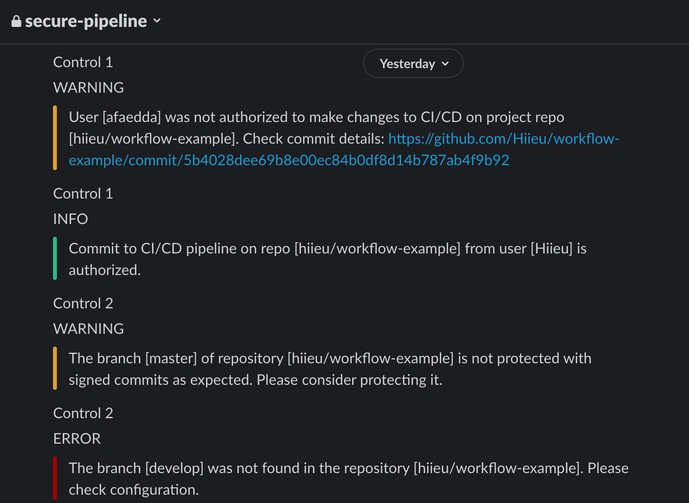

## Notifications

The application allows you to receive notifications about the policies check outcomes on a Slack channel. 

Each notification contains three fields: 

- The policy **control** the notification is for
- The **level** of severity for the notification (*INFO*, *WARNING*, *ERROR*)
- The **message** that provides details for the notification

Here's how *slack notifications* look like for *Control 1* and *Control 2*  

